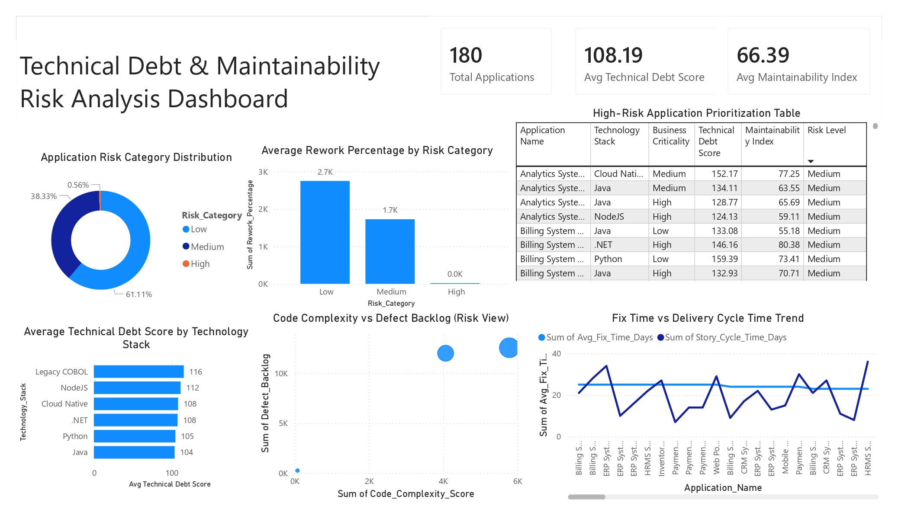

# Technical Debt & Maintainability Risk Analysis Dashboard

## Overview

This Power BI dashboard provides a comprehensive analysis of technical debt, maintainability risks, code complexity, defect backlog, and software delivery performance across enterprise applications.

The dashboard helps engineering teams, project managers, and technology leaders identify high-risk applications, prioritize remediation efforts, and improve software maintainability.

---

## Dashboard Preview

---

## Business Problem

Technical debt accumulates over time due to rushed development, legacy code, and insufficient maintenance. High technical debt increases development costs, slows delivery, and introduces operational risks.

This dashboard enables organizations to:

- Identify applications with high technical debt
- Monitor maintainability across technology stacks
- Prioritize high-risk applications
- Analyze defect backlog and code complexity
- Improve software delivery performance

---

## Key KPIs

| KPI | Description |
|------|-------------|
| Total Applications | Total applications analyzed |
| Avg Technical Debt Score | Average technical debt across applications |
| Avg Maintainability Index | Overall maintainability score |

---

## Dashboard Features

### Application Risk Category Distribution
Visualizes the proportion of applications categorized as Low, Medium, and High Risk.

### Average Rework Percentage by Risk Category
Measures rework effort associated with different risk levels.

### High-Risk Application Prioritization Table
Identifies applications requiring immediate remediation based on risk indicators.

### Technical Debt by Technology Stack
Compares technical debt across technology platforms such as Java, Python, .NET, NodeJS, Cloud Native, and Legacy COBOL.

### Code Complexity vs Defect Backlog
Highlights the relationship between application complexity and accumulated defects.

### Fix Time vs Delivery Cycle Time Trend
Analyzes software maintenance efficiency and delivery performance.

---

## Tools & Technologies

- Power BI
- Power Query
- DAX
- Data Modeling
- Data Visualization

---

## Skills Demonstrated

- Data Analysis
- Risk Analytics
- KPI Development
- Dashboard Design
- Business Intelligence
- Executive Reporting
- Software Engineering Analytics
- Data Storytelling

---

## Key Insights

- Applications with higher technical debt tend to have larger defect backlogs.
- Increased code complexity contributes to maintenance challenges.
- Certain technology stacks show higher debt accumulation.
- Delivery cycle performance is impacted by technical debt levels.
- High-risk applications can be prioritized for remediation based on business impact.

---

## Business Impact

This dashboard enables organizations to:

- Reduce software maintenance costs
- Improve application stability
- Prioritize modernization initiatives
- Optimize engineering productivity
- Improve software delivery performance
- Support technology governance decisions
